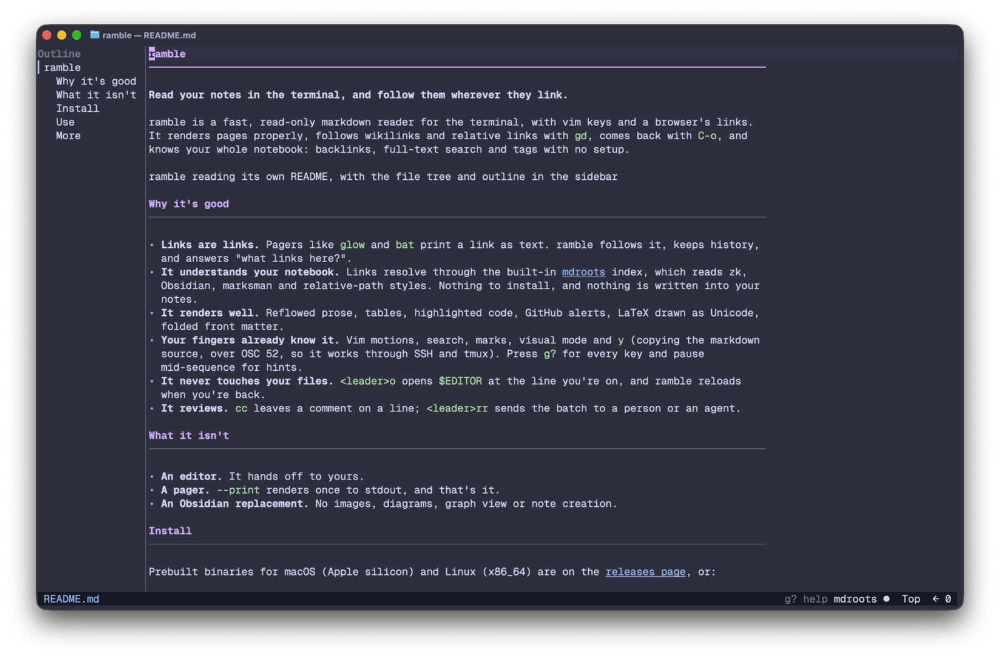

# ramble

**Read your notes in the terminal, and follow them wherever they link.**

ramble is a fast, read-only markdown reader for the terminal. It renders a
page properly (reflowed prose, tables, syntax-highlighted code, callouts), lets
you follow any link with `gd`, and comes back with `C-o`, like a browser with
vim keys. Point it at a folder of notes and wikilinks, backlinks, hover
previews, full-text search and tags all work, without opening an editor or
installing anything else: the notebook index is built in, from
[mdroots](https://github.com/martintrojer/mdroots).



## Why

Reading markdown in a terminal usually means one of two compromises:

- **A pager** (`glow`, `mdcat`, `bat`). Pretty output, but a link is just
  text. You can't follow it, you can't go back, and you can't ask "what links
  here?".
- **Your editor.** Everything works, but you're in an editor: modes,
  buffers, a cursor that can change the file, and a setup step every time you
  just want to read.

ramble is the reading half of the editor, done properly. It never writes your
files. When you do want to edit, `<leader>o` opens `$EDITOR` at the line you're
looking at (`$VISUAL`, then `$EDITOR`), and ramble reloads the page when you come back.

Other readers resolve links with their own guesses. ramble resolves them
with mdroots, a markdown notebook index that understands the link styles of
[zk](https://github.com/zk-org/zk), Obsidian,
[marksman](https://github.com/artempyanykh/marksman) and plain relative
paths across the whole notebook. If you'd rather it asked the language
server your editor already uses, point it at zk or marksman in the config.

## What you get

**Reading**
- CommonMark and GFM: headings, lists, task lists, tables, footnotes, GitHub
  alerts, block quotes. Prose is reflowed to the terminal width (capped at a
  readable maximum).
- Syntax-highlighted code blocks (catppuccin-mocha), including the language
  names people actually write (`py3`, `shell`, `jsx`, `rust,ignore`, `{.python}`).
- LaTeX math drawn as Unicode: `$E = mc^2$` reads as E = mc², and `$$\frac{a+b}{c}$$`
  becomes a real stacked fraction. Inline `$…$`, display `$$…$$` and ```` ```math ````
  fences all work.
- Front matter (YAML `---` or TOML `+++`) shows as a folded `▸ front matter · 5 keys`
  row; `za` (or `Enter` on it) expands it into a key/value table. Broken
  front matter is shown as best it can be.
- `gR` toggles the raw markdown source, highlighted, with every motion still
  working.

**Moving around**
- A real cursor and vim motions: `hjkl w b e 0 $ { } gg G H M L`, counts,
  `C-d C-u C-f C-b`, `zz zt zb`.
- `/` `?` `n` `N` `*` `#` search within the page; `m{a-z}` / `'{a-z}` marks.
- `]l` / `[l` jump between links, `;` / `,` repeat, `]]` / `[[` jump between
  headings, and `s` puts a hint label on every visible link so you can jump to
  one in two keystrokes.

**Selecting and copying**
- Visual mode the way your fingers expect: `v`, `V` and `C-v`, `o` to swap
  ends, `gv` to reselect.
- The yank operator with vim's rules: `yy`, `Y`, `3yy`, `yw`, `y}`, `yG`,
  `y'a`. It copies the markdown source, not the rendered text, so a pasted
  link is still a link.
- `yf` / `yF` copy the file's absolute or relative path; `yu` copies the URL
  of the link under the cursor.
- Copies go to the system clipboard over OSC 52, so they work over SSH and
  inside tmux.

**Mouse**
- Click to place the cursor, pick a file or heading, or select a picker
  item. Click a folder's `▸` to open or close it.
- Double-click a link to follow it, a file to open it, a heading to jump
  there, or a word to copy it. Triple-click copies the line.
- Drag over text to select and copy it, like visual `y`; dragging past the
  edge scrolls.
- The wheel scrolls whatever is under the pointer without moving focus.
- Shift+drag still makes your terminal's own selection. Set
  `[mouse] enabled = false` to leave the mouse to the terminal or tmux.

**Following links**
- `gd`, `Enter` or `C-]` follows the link under the cursor: markdown files
  open in ramble, `#anchors` jump to the heading, URLs open in your browser,
  anything else opens in your editor.
- Inline code that names a real file is a link too: `` `src/main.rs:12` ``
  opens that file at line 12.
- `C-o` / `Tab` go back and forward. Each page remembers its cursor, scroll
  position and sidebar layout.

**The sidebar**
- A file tree (respects `.gitignore`, walks lazily, so pointing it at `$HOME`
  is fine), the current page's outline, or both stacked.
- On `auto` it shows the tree until you open something, then the outline.
  `<leader>e` shows or hides it, `<leader>E` cycles outline, files and
  split, `C-w h/l/j/k` moves between panes. It sits on the left or the
  right (`side`, `:Sidebar left|right`); `C-w h/l` follow the screen.
- `show = "auto"` makes it a peek: hidden while you read, shown while you
  use it (`C-w` into it, `<leader>E`), hidden again when you open a file,
  jump to a heading, click the text or press `Esc`. When the page has no
  room to spare it opens over the text instead of reflowing it.
  `<leader>e` pins it.
- In the tree, `-` moves the root up a folder (so does `h` on a top-level
  row) and `.` makes the selected folder the root. The title shows where
  you are: `Files ~/notes/sub`.
- It sizes itself to what it shows, within bounds, so a short outline doesn't
  waste half the screen. Long names are clipped with `…` (file names in the
  middle, so the extension stays), and the current heading and the open
  file are marked with `▎` on the left, where clipping can't hide them.
- It hides on terminals narrower than 80 columns and comes back when the
  terminal grows, unless you hid it. With no file open, the tree always
  shows and has focus.

**Notebook features, built in**
- Wikilinks resolved by your notebook, not by filename guessing.
- `K` previews the link target without leaving the page.
- Broken links are dimmed as you read.
- Pickers: notes (`<leader>zf`), the links on this page (`<leader>zl`),
  backlinks to this page (`<leader>zb` or `grr`), full-text search
  (`<leader>zs`) and tags (`<leader>zz`).
- No setup and no external tools. The index lives in your user cache dir
  (`MDROOTS_CACHE_DIR` points it elsewhere), never in your notes.

**Optional: a language server**
- An `[[lsp.server]]` entry (zk or marksman, or any markdown server as
  `generic`) serves the pages under its root markers instead; every other
  page stays on the built-in index.
- A configured server that isn't installed is reported once, the first time
  a page needs it, instead of as an error on every page.

**Around the edges**
- Live reload when the file changes on disk, keeping your place and the
  folders you collapsed. `C-l` (or `:e`) re-reads the page
  and the file tree on demand.
- Launchers: configurable keys that hand off to another program and come
  back. `<leader>o` opens your editor at the cursor line.

**Comments**
- `cc` comments on the cursor line; visual `c` on the selected lines. Works
  in the raw view too.
- A comment box opens directly below the commented lines (above them when
  there's no room), so they stay in view and stay highlighted. Its title
  shows the kind and the lines (`comment [ISSUE] L12-18`); it grows with the
  text up to 8 rows, then scrolls. Enter saves, `C-j` or `Alt-Enter` adds a
  new line, Esc cancels, `C-e` moves it into `$EDITOR`; readline keys and
  Up/Down edit it. A paste keeps its newlines in the box and lands as one
  line in every other prompt; outside a prompt it does nothing.
- Tab / S-Tab give the comment a kind (`comment [ISSUE] L5`): untyped, then
  issue, suggestion, question, nit, then untyped again. The list is
  `[review] kinds`. The kind shows as `[ISSUE]` in the status line, `K` and
  `<leader>rl`, and the export labels the item and explains the kind.
- Comments go to [debrief](https://github.com/martintrojer/debrief)'s
  review batch for the repo, in your cache dir, never into the repo.
- Commented lines get a `●` in a gutter, files a `●` and a count in the
  tree; `]r` / `[r` jump between them. Comments added elsewhere (another
  ramble, debrief) show up within a second.
- On a commented line the status line shows the comment's first line; `K`
  shows the whole comment (or comments) there, and the link preview
  anywhere else.
- `<leader>rl` lists every comment in the batch, diff comments from debrief
  included. Typing filters, Enter jumps to the comment (opening its file),
  `C-d` removes it and `C-e` edits it in `$EDITOR`.
- `<leader>rr` sends the batch as markdown to `[send] command` on stdin
  (with `DEBRIEF_ROOT` set), or copies it to the clipboard when there is no
  command or it fails, then clears the batch.
- The window or tmux pane title shows the file you're reading.
- `g?` lists every key that works right now. The list is tested against the
  real keymap, so it can't drift.
- Pause after the first key of a sequence (`g`, `<leader>`, `C-w`, `y`) and a
  small box in the corner lists the keys that can come next.

## Install

```sh
cargo install --path .
```

This also installs a small `fake-lsp` helper used by the test suite; you can
delete it. Nothing else is needed: the notebook features are built in.

## Use

```sh
ramble notes/index.md        # read a file
ramble notes/                # browse a folder
cat README.md | ramble       # read stdin (keys come from the terminal)
ramble --print doc.md        # render once to stdout, like a pager would
ramble doc.md | less -R      # same, automatically, when stdout is a pipe
```

Inside, press `g?` for the full list of keys.

## Configure

ramble works with no config file. To customise it:

```sh
ramble --init-config         # writes ~/.config/ramble/config.toml
```

The file lists every option with its default, commented out. The ones you're
most likely to change:

```toml
[render]
max_width = 100              # cap the reading width
math = true                  # false shows LaTeX source as written

[sidebar]
show = "always"              # always | never | auto (peek); <leader>e toggles
default = "auto"             # auto | files | outline | split
width = "auto"               # fit the rows; or a number of columns
min_width = 16               # bounds of the auto width
max_width = 48               # also capped at 35% of the terminal width
auto_hide_below = 80         # hide below this many columns; 0 never hides
reading = "outline"          # what auto shows while you read: outline | split
side = "left"                # left | right; :Sidebar left|right switches it

[keys]
leader = " "
clue = true                  # after a pause mid-sequence, show the next keys

[mouse]
enabled = true               # false leaves the mouse to the terminal / tmux

[review]
kinds = [                    # Tab in the comment box; [] = untyped only
  { id = "issue", definition = "Something is wrong. Fix it." },
  { id = "question", definition = "Answer in your reply." },
]

[send]                       # <leader>rr: where the review goes
command = ["sh", "-c", "mu agent send worker-1 \"$(cat)\""]  # [] copies it
preamble = "Please address these comments."  # replaces the opening paragraph

[[lsp.server]]               # optional: zk serves pages under a .zk root
kind = "zk"                  # (none by default; the built-in index serves all)
command = ["zk", "lsp"]
root_markers = [".zk"]

[[launch]]                   # add your own hand-offs
name = "lazygit"
key = "<leader>g"
command = ["lazygit"]
needs_vcs = true
```

## How it works

ramble parses markdown with pulldown-cmark and lays it out itself, keeping a
map from every drawn cell back to the source bytes it came from. That map is
what makes the cursor, search, link hints, review markers and "open the editor
at this line" all line up with the file on disk.

Notebook knowledge comes from mdroots, running in-process on a worker
thread so it never blocks the UI: the page renders immediately, and link
targets and broken-link marks arrive when the index answers. A configured
language server is reached over a small stdio JSON-RPC client the same way.

The full design and the decisions behind it are in
[docs/specs/2026-10-07-ramble.md](docs/specs/2026-10-07-ramble.md).

## Status

Young and moving fast. It's built to replace a glow-plus-nvim reading setup,
and its end-to-end tests also run against real zk and marksman when
they're installed. Expect sharp edges in the corners
the tests don't reach yet.

## License

MIT
